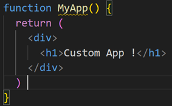
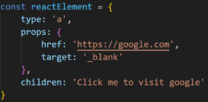
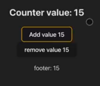
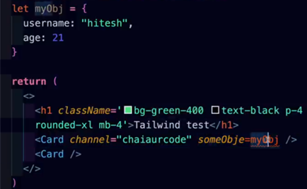
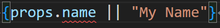
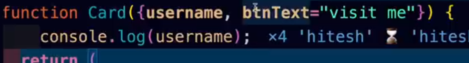
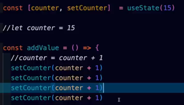
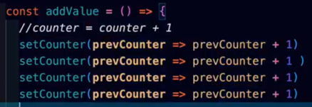

# React

**React Documentation:** <a href="https://react.dev/learn">Click Here</a><br>
Don't follow legacy documentation of react. That documentation is old.
Always search for `react.dev`.

## Two methods to create a react application
1. Using `create-react-app`
    - command `npx create-react-app`
    - It does take some time to install because it sets up a robust environment for developing a full-featured React application.
    - It includes a number of dependencies that might not be necessary for every project, but are often useful.
2. Using Vite
    - command `npm create vite@latest`
    - Vite is indeed faster than `create-react-app` because it uses a different module bundler (esbuild), which is faster than webpack used in `create-react-app`
    - It only gives you two dependencies preinstalled i.e react and react-dom
    - So you can use this to create react project.

## Why react was created?
- Phantom Message / Ghost Message Problem

React was created to solve the issue of keeping the UI in sync with the state. This was a significant problem at Facebook, where they noticed ‘ghost’ notifications - the notification count didn’t update correctly after a notification was read. React solves this problem by introducing a virtual DOM and a diffing algorithm, which ensures that the actual DOM gets updated only when necessary, leading to efficient and reliable UI updates. This makes it easier to build complex UIs while ensuring they stay in sync with the underlying state.

```
Problem: 
State (all variables) -->  managed by --> JS
UI --> managed by --> DOM

In past, there was no synchronization in between state and DOM. To solve this problem react was created.
```

## React is a library
Framework is like a military because its rules are very important to follow and Library is like a cool dude where rules are not strict.

## SPA: Single Page Application
In a React application, `index.html` serves as the main and only HTML file that gets loaded in the browser. This file acts as a container where all the React components are rendered. This is achieved through DOM manipulation, where JavaScript dynamically updates the content of the index.html file.

This architecture is characteristic of Single Page Applications (SPAs). In SPAs, all necessary code (HTML, JavaScript, and CSS) is retrieved with a single page load, or the appropriate resources are dynamically loaded and added to the page as necessary, usually in response to user actions. This means that the page does not reload during the entire interaction with the app, providing a smooth and seamless user experience, similar to a desktop application.

In the context of React, the SPA architecture allows developers to build complex user interfaces that can update and change in response to data changes, without requiring a page reload. This makes React a powerful tool for building fast, dynamic web applications.


## React application structure and its execution

### Entry Point
The main entry point of a React application is typically `src/index.js`, but it can be named anything (such as `main.js`). This is the JavaScript file where the React application starts executing.

### React and ReactDOM
React is a JavaScript library for building user interfaces. It allows you to create reusable UI components. ReactDOM is an implementation of React for the web. It provides methods to render a React element into a DOM node, and to update the React element as data changes.

### React’s Virtual DOM
React creates its own Virtual DOM, a tree-like structure that mirrors the actual DOM. When state changes in a React application, React compares the new Virtual DOM with the old one, and updates the actual DOM only where changes have occurred. The `createRoot` method refers to `div` element with id `root`. And stores it’s reference.

### JavaScript in HTML
With JavaScript, we can write HTML, providing programming capabilities within HTML. This allows for dynamic content in web applications.

### Script Loading
- In a project created with `create-react-app`, the `index.js` file is loaded without explicitly adding a script tag in the `index.html` file. This is handled by `react-scripts`, which automatically adds the necessary scripts during the build process.
- In a project created with Vite, `react-scripts` is not included. Instead, Vite handles the necessary scripting. The script is directly passed into the HTML file, which allows for faster loading and execution.

### Component Naming
In Vite, whenever you create a component, the file name should have a `.jsx` extension. The **component name should start with a capital letter**. This is a common convention in React and helps differentiate between built-in components and user-defined ones.

### React’s Single Element Export
In React, a component can export only one HTML element. To group multiple elements, we wrap all code in a `<div>` tag. Alternatively, we can use an empty tag `<>...</>`, known as a Fragment. This allows us to return multiple elements from a component without adding an extra node to the DOM.

### JSX Syntax
React uses JSX, a syntax extension for JavaScript, that allows us to write HTML-like code in our JavaScript. This mixed syntax of JavaScript and HTML is parsed and converted into JavaScript objects at runtime.

<br>
React don't understand above syntax.

<br>
 <br>
React understand this converted syntax.


### Bundlers in react
React applications typically use a bundler like Babel or Vite’s own bundler. Bundlers convert the jsx syntax into javascript.

### Component invocation in react
In React, components should be invoked using JSX syntax like `<MyApp />`. Although it’s technically possible to invoke a component as a function like `MyApp()`, this is not recommended as it can lead to unexpected behavior and issues with component lifecycle and state management.

### React’s Responsiveness to State Changes
React is designed to respond to changes in state variables. If a state variable updates, React ensures that the change is reflected everywhere the state variable is used. 


<br> Here as one state change it's change is reflected everywhere.

### React’s Solution to UI Updates
In plain JavaScript, updating the same value in multiple places requires multiple query selector statements. React simplifies this by handling UI updates automatically. If the UI needs to update, React takes care of it, not the developer.

### React Hooks
React provides methods called hooks that allow your UI to update in response to state changes. Each hook has its own specific task.

### useState Hook
The useState hook is a fundamental hook in React that propagates changes in your UI. It can be initialized with any default value (`true, false, “”, number, {}, []`). The useState hook returns two things in an array format: a variable representing the current state, and a method to update that variable

When a state update function (like setCounter) triggers, React automatically analyzes the DOM and updates all places where that value is used.

### Virtual DOM in React
The Virtual DOM is a core concept in React. It’s an in-memory representation of the Real DOM. The Virtual DOM was a key feature of React, but it’s not that React doesn’t use it anymore, it’s just that with the advent of the Fiber architecture, the way React uses the Virtual DOM has evolved.
*Learn more from internet*

### createRoot Method
The `createRoot` method is used in React to create a root fiber node on a DOM element with a specific id, typically ‘root’. This method is part of the ReactDOM package and is used to create a root from which a React component tree can be rendered.

### React Fiber
React Fiber is a reimplementation of React’s core reconciliation algorithm. It’s the result of over two years of research by the React team. The goal of React Fiber is to increase its suitability for areas like animation, layout, and gestures8. Its headline feature is incremental rendering: the ability to split rendering work into chunks and spread it out over multiple frames.
*Learn more about React Fiber on: <a href="https://github.com/acdlite/react-fiber-architecture.git">acdlite
/react-fiber-architecture</a>*

### Reconciliation in react
Reconciliation is the process by which React updates the DOM. When a component’s state changes, React has to calculate if it is necessary to update the DOM. It does this by creating a new Virtual DOM and comparing it with the current DOM

### Keys in React Fiber
When rendering lists in React, it’s important to specify a key prop for each child in the list. Keys help React identify which items have changed, are added, or are removed, and should be stable, predictable, and unique. This allows React to be more efficient when re-rendering lists.

### Props 
- In React, props (short for properties) make components reusable. By default, a component gets access to props, but props doesn’t contain anything.

- If you want to pass an object or an array in props, it can’t be passed directly. You need to declare that in a variable and then pass.
 <br>

- Props in React is an object. So, you can access its values by dot notation method.

- If you do not send any prop for a specific property, you can give it a default value. <br>
    - You can give a default value directly in a code but it's not good for readablility.
    
    - Better is to destructure the prop and give default values.
    

### useState Batched updates VS Individual updates: Interview Question
- In React, the useState hook is a common way to manage state within functional components. When you call setCounter to update the state, React groups these updates together and re-renders the component only once after all the updates have been applied. This batching mechanism improves performance by minimizing unnecessary re-renders.

- However, in certain cases, you might want to bypass this batching behavior and have each setCounter call trigger an individual update. This can be useful when you need to ensure that multiple state updates are applied in a specific order, or when you want to perform side effects after each update.

- Code Example: 

Since these calls are made within the same event handler, React batches them together and updates the state only once, resulting in a final increment of 1.

    
    The code is modified to use a callback function with setCounter.
The callback receives the previous state (prevCounter) as an argument.
Each call to setCounter now triggers an individual update, ensuring that the counter increments by 1 each time.

- Key Points:
    - By default, useState updates are batched for performance optimization. Use the callback syntax for setCounter to force individual updates when needed. Individual updates can be useful for ensuring update order or performing side effects.

- Additional Considerations:
    - While individual updates can be useful in specific cases, keep in mind that they can potentially impact performance if used excessively. Consider using other techniques like refs or the useEffect hook if you need more granular control over updates or side effects.


### React Hooks in Password Generation Program
In a password generation program, you might need to continuously call certain functions, such as when a slider is moved or when options like numbers or symbols are selected12. However, continuously running these functions can be unoptimized. To optimize this, React provides us with some hooks.

- **useCallback Hook**
    useCallback is a React Hook that lets you cache a function definition between re-renders. This is particularly useful when passing callbacks to optimized child components that rely on reference equality to prevent unnecessary renders.

- **useEffect Hook**
    useEffect is a React Hook that lets you perform side effects in function components. It is a close replacement for `componentDidMount`, `componentDidUpdate`, and `componentWillUnmount` in class components. It runs after every render but can be optimized to run only when certain values have changed

- **useRef Hook**
    useRef is a React Hook that lets you create a mutable reference object. The `.current` property of the returned object is initialized with the passed argument and persists for the full lifetime of the component

### Somethings about hooks
- Hook is an itself a method. Which returns an array `[variable, function]`. Maximum times hooks return only javascript so keep that file’s extension ‘JS’ not ‘jsx’. It’s a good practice.
- Custom hooks can also be able to use built in hooks.
- Hooks name start with *use*. It’s a standardized approach.


## React Router
- Refer: `09_react_router\` this project
- When you install `react-router-dom` then it gives you `Link` and `NavLink`.
    You can understand it as, `Link` instead of `<a>` tag. But unlike the `<a>` tag, `Link` doesn't refresh the page. And for `href` there is an option called `to`.

- There are two methods to use react-router you can learn from `09_react_router\src\main.jsx` this file.

### Layout: 
In React, a common pattern for building UIs is to create a Layout component that contains common elements such as headers and footers. Instead of including these elements in every component, you can include them once in the Layout component and wrap your other components inside it. This approach is more optimized and makes your components reusable. We pass other components in Layout dynamically by using `outlet`.

Outlet is a component in React Router that renders the child route elements. It allows nested UI to show up when child routes are rendered. If the parent route matched exactly, it will render a child index route or nothing if there is no index route. This makes it possible to create dynamic and nested routes in your React application.

### Loader: 
If you want to fetch data from any website/database, then you can make an API call directly from here. When you point a cursor on the link at that time it will fetch the data. It also does it first than useEffect. It does it before clicking that element. It already fetched the data and stored it in cache.


## Context API

### Prop Drilling in React
Prop drilling refers to the process of passing data from a component higher up in the React component hierarchy (a parent) to a component further down in the hierarchy (a child or descendant) using props. This often involves passing data through various levels of components that do not directly need the data, just to reach the ones that do.

### Why prop drilling is a problem?
Prop drilling can lead to issues with component reusability and app performance. The problem with this approach is that most of the components through which this data is passed have no actual need for this data. They are simply used as mediums for transporting this data to its destination component. This can cause major issues with component reusability and app performance.

### Solution of this problem
There are several ways to overcome prop drilling, including using the Context API, Redux, or other state management libraries. These tools allow you to store state in a central location and access it from any component, eliminating the need to pass data through intermediate components.